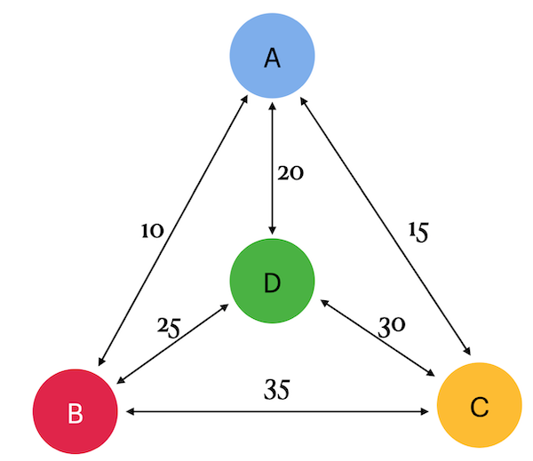

## General Rules

- Use this page as your only reference. Do not listen to rumors and speculations about how to prepare your solution.
- Make sure you are using the latest version of PostgreSQL.
- It is perfectly fine if you use the IDE to write source code (aka SQL script).
- To be evaluated, your solution must be in your GIT repository.
- Your solutions will be evaluated by your peers.
- You should not leave any files in your directory other than those explicitly specified by the exercise instructions. It is recommended that you modify your `.gitignore` to avoid accidents.
- Got a question? Ask your neighbor to the right. Otherwise, try your neighbor on the left.
- Your reference manual: mates / Internet / Google. 
- Read the examples carefully. You may need things not specified in the topic.
- And may the SQL-Force be with you!
Absolutely anything can be represented in SQL! Let's get started and have fun!

## Rules of the day

- Please make sure you have your own database and access for it on your PostgreSQL cluster. 
- All tasks contain a list of Allowed and Denied sections with listed database options, database types, SQL constructions etc. Please have a look at this section before you start.

## Exercise 00 — Classical TSP

| Exercise 00: Classical TSP|                                                                                                                          |
|---------------------------------------|--------------------------------------------------------------------------------------------------------------------------|
| Turn-in directory                     | ex00                                                                                                                     |
| Files to turn-in                      | `team00_ex00.sql` DDL for table creation with INSERTs of data; SQL DML statement                                                                                |
| **Allowed**                               |                                                                                                                          |
| Language                        | ANSI SQL|
| SQL Syntax Pattern                        | Recursive Query|

Take a look at the Graph on the left. 
There are 4 cities (a, b, c and d) and arcs between them with costs (or taxes). Actually, the cost is (a,b) = (b,a).

Please create a table with named nodes using structure {point1, point2, cost} and fill data based on a picture (remember there are direct and reverse paths between 2 nodes).
Please write a SQL statement that returns all tours (aka paths) with minimum travel cost if we start from city "a".
Remember, you need to find the cheapest way to visit all cities and return to your starting point. For example, the tour looks like a -> b -> c -> d -> a.

Below is an example of the output data. Please sort the data by total_cost and then by tour.

| total_cost | tour |
| ------ | ------ |
| 80 | {a,b,d,c,a} |
| ... | ... |

## Exercise 01 — Opposite TSP

| Exercise 01: Opposite TSP|                                                                                                                          |
|---------------------------------------|--------------------------------------------------------------------------------------------------------------------------|
| Turn-in directory                     | ex01                                                                                                                     |
| Files to turn-in                      | `team00_ex01.sql`     SQL DML statement                                                                             |
| **Allowed**                               |                                                                                                                          |
| Language                        | ANSI SQL|
| SQL Syntax Pattern                        | Recursive Query|

Please add a way to see additional rows with the most expensive cost to the SQL from the previous exercise. Take a look at the sample data below. Please sort the data by total_cost and then by trip.

| total_cost | tour |
| ------ | ------ |
| 80 | {a,b,d,c,a} |
| ... | ... |
| 95 | {a,d,c,b,a} |

